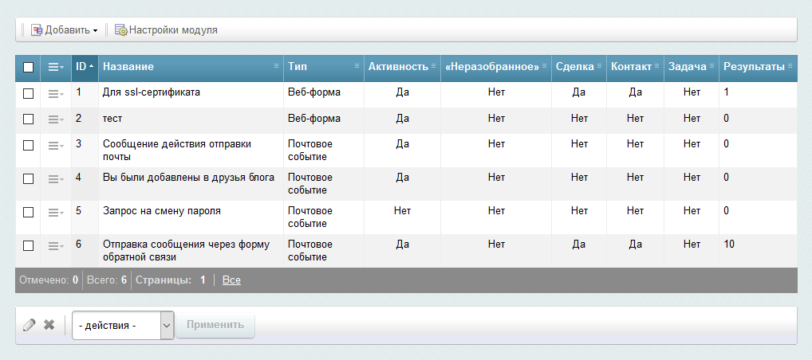

# Правил интеграции с amoCRM
Список правил интеграции с amoCrm находится в административной части сайта по адресу «Сервисы» - «Интеграция с amoCRM».

Примерный вид списка правил интеграции 

Каждое правило интеграции позволяет осуществлять интеграцию одного почтового события или одной веб-формы с amoCRM.

## Возможности:
* [добавление нового правила интеграции](./rules/add.md)
* изменение нового/существующего правила интеграции
* просмотр результатов для правила интеграции
* импорт выбранных результатов в amoCrm

Интерфейс настройки прави
* Возможности
* Создание нового правила интеграции
* Настройка правила интеграции

# Возможности
Интерфейс позволяет
1. Создавать новые правила интеграции для веб-форм и почтовых событий
2. Переходить к просмотру результатов для созданных правил интеграции

> Обратите внимание, что если по каким-то причинам подключение к amoCRM установить не удалось, то все уже существующие правила интеграции отображены не будут.

### Раздел «Общие настройки»

1. интеграция включена - можно отключить правило интеграции, тогда данные в amoCrm отправлены не будут.
2. ответственный пользователь - выбор отвественного за создаваемые сделку и/или контакт;
3. теги - будут добавлены в поле "теги" к создаваемым сделке и/или контакту
4. формат - html - информация передается "как есть", text - информация будет очищена от тегов, переносы строк сохранены;
5. группировать примечания
6. Искать метки рекламных компаний в cookies
7. Добавлять в «Неразобранное»
8. Название сделки в «Неразобранном»

### Раздел «Сделка»
Позволяет настроить значения по умолчанию для пользовательских полей сделки.

### Раздел «Контакт»
Позволяет настроить соотношение между полями интегрируемого почтового события или веб-формы и создаваемого контакта в amoCRM.

### Раздел «Задача»
Позволяет настроить соотношение между полями интегрируемого почтового события или веб-формы и создаваемой задачи в amoCRM.

Раздел находится в процессе наполнения