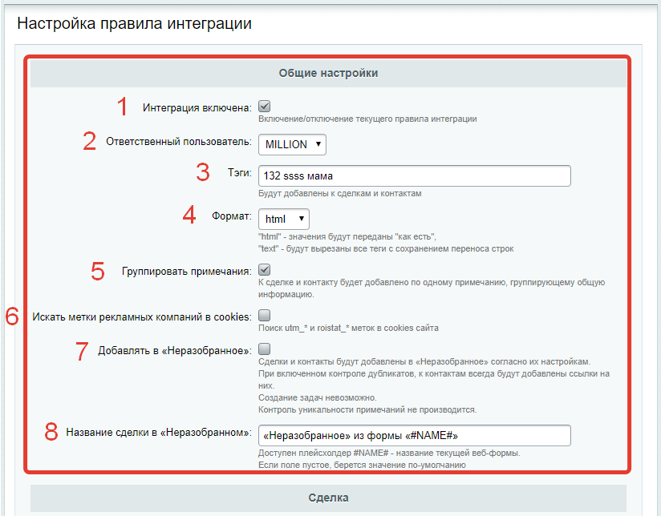

# Настройка «AmoCRM - интеграция с веб-формами и почтовыми событиями»
Настройка решения производится в административной части сайта по адресу «Настройки» - «Настройки модулей» - «AmoCRM - интеграция с веб-формами и почтовыми событиями». 

## Настройка подключения к amoCRM
Для настройки подключения на первой вкладке необходимо ввести:

* ваш домен на проекте amoCRM;
* email (логин);
* Ключ для авторизации в API (находится в настройках вашей amoCRM в разделе API. Обратите внимание, что после смены пароля, ключ сбрасывается и устанавливается новый).

и нажать на кнопку «Подключиться к amoCRM» либо «Сохранить»/«Применить».

Если введенные данные корректны, то статус в заголовке первой вкладки измениться с «нет подключения» на «есть подключение». Если в процессе подключения возникла ошибка, то информация о ней отобразиться над вкладками.

После успешного подклчения к amoCRM модуль предоставит возможность создавать правила интеграции для почтовых событий и веб-форм (в старших редакциях Битрикса). 

Обратите внимание, что если по каким-то причинам подклюяение к amoCRM установить не удалось, то все уже существующие правила интеграции отображены не будут.

### Включение и выключение всех правил интеграции
Все правила интеграции можно отключить, не нарушая подключение к amoCRM, для этого надо снять галочку «Интеграция включена» под кнопкой «Подключиться к amoCRM».

## Правила интеграции
Каждое Правило интеграции позволяет настроить интеграцию одного почтового события или одной веб-формы с amoCRM. Решение позволяет создать по одному правилу для каждых веб-формы и почтового события.

### Раздел «Общие настройки»

1. интеграция включена - можно отключить правило интеграции, тогда данные в amoCrm отправлены не будут.
2. ответственный пользователь - выбор отвественного за создаваемые сделку и/или контакт;
3. теги - будут добавлены в поле "теги" к создаваемым сделке и/или контакту
4. формат - html - информация передается "как есть", text - информация будет очищена от тегов, переносы строк сохранены;
5. группировать примечания
6. Искать метки рекламных компаний в cookies
7. Добавлять в «Неразобранное»
8. Название сделки в «Неразобранном»

### Раздел «Сделка»
Позволяет настроить значения по умолчанию для пользовательских полей сделки.

### Раздел «Контакт»
Позволяет настроить соотношение между полями интегрируемого почтового события или веб-формы и создаваемого контакта в amoCRM.

### Раздел «Задача»
Позволяет настроить соотношение между полями интегрируемого почтового события или веб-формы и создаваемой задачи в amoCRM.

Раздел находится в процессе наполнения

[на главную](./README.MD)